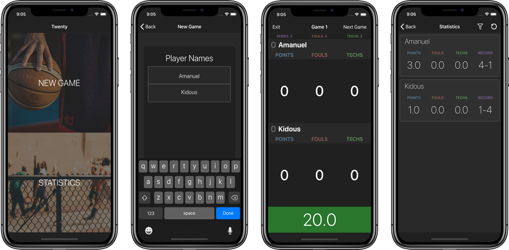

# Twenty

### Here's a Few Things I Learned 👨🏾‍💻
🎨 Implementing **xibs** for custom views 
⏱ Working with Foundation's **Timer** class 
💾 Storing data using **Core Data** 
📸 Taking screenshots of app with the help of Fastlane's [**snapshot**](https://docs.fastlane.tools/getting-started/ios/screenshots/) 
📝 Creating custom **protocols** to implement a **delegate pattern** 
✅ Adding units tests using **XCTest** 
💾 Storing small amounts of data using **UserDefaults** 